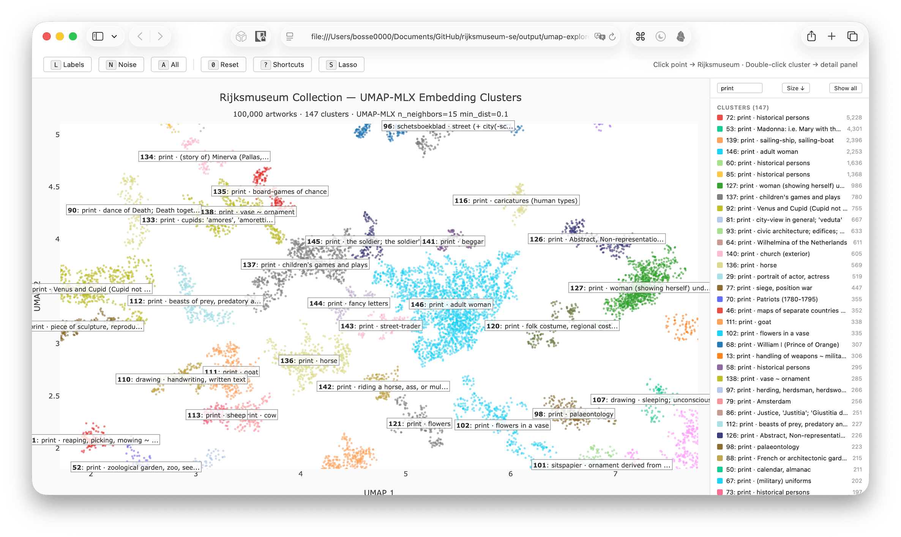

# Rijksmuseum Semantic Explorer

Interactive visualization of the Rijksmuseum collection's 831K artwork embeddings, using MLX-accelerated dimensionality reduction on Apple Silicon.



Reduces 384-dimensional [multilingual-e5-small](https://huggingface.co/intfloat/multilingual-e5-small) embeddings to 2D with [UMAP-MLX](https://github.com/hanxiao/umap-mlx), [t-SNE-MLX](https://github.com/hanxiao/tsne-mlx), and [PaCMAP-MLX](https://github.com/hanxiao/pacmap-mlx), then renders them as interactive Plotly scatter plots with hover metadata (title, creator, type, subjects, materials).

## Project Structure

```
lib/embeddings.py                  — Shared: load, decode, normalize, sample embeddings + metadata
notebooks/
  01-umap-explore.ipynb            — UMAP notebook with interactive Plotly visualization
  02-pacmap-explore.ipynb          — PaCMAP notebook with interactive Plotly visualization
mathematica/
  01-embedding-geometry.nb         — PCA eigenspectrum, distance distributions, isotropy
  02-semantic-networks.nb          — k-NN graphs, community detection, centrality
  03-creator-stylespace.nb         — Artist centroid similarities, dendrograms, diversity
  04-temporal-journeys.nb          — Style drift, temporal trajectories, anachronism detection
  05-metadata-landscapes.nb        — Co-occurrence, separability, word clouds, type networks
  export_for_mathematica.py        — Python data bridge (exports .bin + .json for Mathematica)
scripts/
  generate-umap-explorer.py        — UMAP HTML explorer generator
  generate-tsne-explorer.py        — t-SNE HTML explorer generator
  generate-pacmap-explorer.py      — PaCMAP HTML explorer generator
  generate-umap-animation.py       — UMAP epoch-by-epoch animation (MP4)
  _html_template.py                — Shared HTML/Plotly template for explorers
data/                              — Symlinked database files (see below)
output/                            — Generated HTML files (.gitignore'd)
```

## Data Dependencies

This project requires two SQLite databases that are **not included** in this repository. They are expected as symlinks in `data/`:

| File | Contents | Source |
|------|----------|--------|
| `data/embeddings.db` | 831,667 artwork embeddings (int8-quantized, 384 dims) | [`rijksmuseum-mcp-plus`](https://github.com/your-org/rijksmuseum-mcp-plus) |
| `data/vocabulary.db` | Structured metadata (titles, creators, types, subjects, materials, techniques) | Same |

Both are symlinked from `../rijksmuseum-mcp-plus/data/`. To set up:

```bash
# Clone the data source repo as a sibling directory
git clone <rijksmuseum-mcp-plus-url> ../rijksmuseum-mcp-plus

# Create symlinks (already in place if you cloned this repo next to it)
mkdir -p data
ln -s ../../rijksmuseum-mcp-plus/data/embeddings.db data/embeddings.db
ln -s ../../rijksmuseum-mcp-plus/data/vocabulary.db  data/vocabulary.db
```

> **Note:** `vocabulary.db` must use the v0.13+ integer-encoded schema (with `field_lookup`, `mappings`, and `vocabulary` tables).

## Generating Explorers

```bash
uv sync && bash patches/apply-patches.sh          # Install deps + apply local fixes

# Quick 20K-sample explorers (~15s each)
uv run python scripts/generate-umap-explorer.py --sample 20000
uv run python scripts/generate-tsne-explorer.py --sample 20000
uv run python scripts/generate-pacmap-explorer.py --sample 20000

# Full 100K-sample explorers (~2 min each)
uv run python scripts/generate-umap-explorer.py --sample 100000 --output umap-explorer-100K.html
uv run python scripts/generate-pacmap-explorer.py --sample 100000 --output pacmap-explorer-100K.html
```

### Filtering by metadata

All three scripts support `--type`, `--creator`, and `--subject` filters. Filters combine with AND logic and auto-generate descriptive output filenames:

```bash
# All paintings
uv run python scripts/generate-pacmap-explorer.py --type painting

# Rembrandt's paintings
uv run python scripts/generate-umap-explorer.py --type painting --creator "Rijn, Rembrandt van"

# All artworks depicting dogs
uv run python scripts/generate-tsne-explorer.py --subject dog

# Ed van der Elsken's photographs
uv run python scripts/generate-pacmap-explorer.py --type photograph --creator "Ed van der Elsken"
```

HDBSCAN clustering parameters auto-scale to dataset size (capped at `min_cluster_size=100, min_samples=10` for large datasets, scaling down for smaller filtered subsets). Override with `--min-cluster-size` and `--min-samples`.

Output HTML files are self-contained (Plotly CDN only) and written to `output/`.

### Explorer Features

- **Plotly scattergl** — WebGL scatter plot handling 100K+ points
- **Cluster sidebar** — Click to toggle visibility, double-click for detail panel with aggregate stats (subjects, types, creators, materials, techniques)
- **Filter & sort** — Filter sidebar by text, toggle between size and alphabetical sort
- **Zoom-dependent hover** — Hover disabled at overview zoom, auto-enables past 4× to reduce clutter
- **Lasso selection** — Press `S` to toggle lasso mode; draw a selection to see aggregate stats for arbitrary regions
- **Keyboard shortcuts** — `0`–`4` zoom presets (1×–16×), arrow keys to pan, `L` labels, `N` noise, `?` help overlay
- **Click to browse** — Click any point to open its Rijksmuseum collection page

## Mathematica Notebooks

Five Wolfram Mathematica notebooks provide deeper statistical and graph-theoretic analyses that complement the Plotly-based Jupyter explorations:

| # | Notebook | Focus |
|---|----------|-------|
| 1 | `01-embedding-geometry.nb` | PCA eigenspectrum, effective dimensionality, pairwise distance distributions, k-NN density, 3D PCA scatter, isotropy |
| 2 | `02-semantic-networks.nb` | k-NN similarity graph, community detection, degree distribution, betweenness centrality, community composition |
| 3 | `03-creator-stylespace.nb` | Creator centroid similarities, hierarchical clustering dendrogram, intra-artist diversity, 2D style map |
| 4 | `04-temporal-journeys.nb` | Century/period centroids, style drift over time, PCA trajectories, anachronism detection, style velocity |
| 5 | `05-metadata-landscapes.nb` | Type×material co-occurrence, category separability, subject word clouds, type similarity network |

Setup (requires [Wolfram Mathematica](https://www.wolfram.com/mathematica/) 14.0+):

```bash
uv run python mathematica/export_for_mathematica.py   # Export data (~30s, one-time)
```

Then open any `.nb` file in Mathematica. See [`mathematica/README.md`](mathematica/README.md) for details.

## Setup

Requires Python 3.12+ and [uv](https://docs.astral.sh/uv/).

```bash
uv sync                  # Install dependencies
uv run jupyter lab       # Launch notebooks
```

## Dependencies

- **numpy** — Embedding decode and normalization
- **plotly** + **ipywidgets** — Interactive scatter plot visualization
- **matplotlib** — Animation rendering (epoch-by-epoch MP4 via ffmpeg)
- **hdbscan** — Density-based clustering of embedding space
- **[mlx-vis](https://github.com/hanxiao/mlx-vis)** — MLX-accelerated UMAP, t-SNE, and PaCMAP (Apple Silicon)

### Authors

[Arno Bosse](https://orcid.org/0000-0003-3681-1289) — [RISE](https://rise.unibas.ch/), University of Basel with [Claude Code](https://claude.com/product/claude-code), Anthropic.

### Image and Data Credits

Collection data and images are provided by the **[Rijksmuseum, Amsterdam](https://www.rijksmuseum.nl/)** via their [Linked Open Data APIs](https://data.rijksmuseum.nl/).

**Licensing:** Information and data that are no longer (or never were) protected by copyright carry the **Public Domain Mark** and/or **[CC0 1.0](https://creativecommons.org/publicdomain/zero/1.0/)**. Where the Rijksmuseum holds copyright, it generally waives its rights under CC0 1.0; in cases where it does exercise copyright, materials are made available under **[CC BY 4.0](https://creativecommons.org/licenses/by/4.0/)**. Materials under third-party copyright without express permission are not made available as open data. Individual licence designations appear on the [collection website](https://www.rijksmuseum.nl/en/rijksstudio).

**Attribution:** The Rijksmuseum considers it good practice to provide attribution and/or source citation via a credit line and data citation, regardless of the licence applied.

Please see the Rijksmuseum's [information and data policy](https://data.rijksmuseum.nl/policy/information-and-data-policy) for the full terms.

### License

This project is licensed under the [MIT License](LICENSE).
